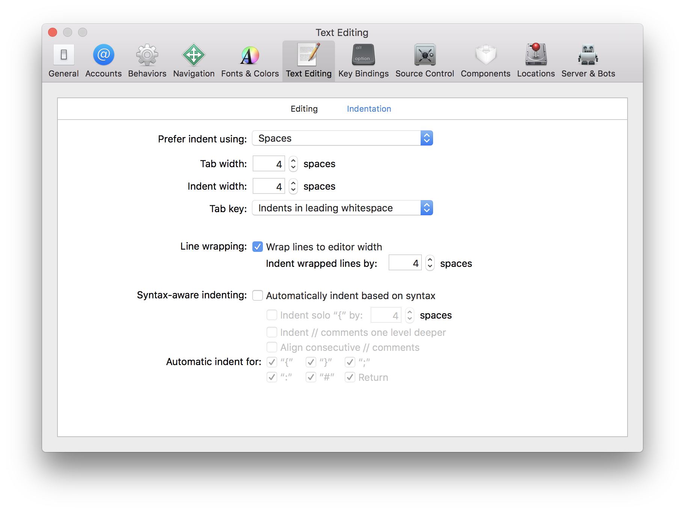

# tools

## xcode-clang-format.applescript

This is an osascript that can use `clang-format `to format a selection in xcode

### Installation

Install [Homebrew](https://brew.sh/):

```
/usr/bin/ruby -e "$(curl -fsSL \
    https://raw.githubusercontent.com/Homebrew/install/master/install)"
```

Install [`clang-format`](https://clang.llvm.org/docs/ClangFormat.html):

```
brew install clang-format
```

Clone this repository:

```
cd <where-you-want-it>
git clone https://github.com/sean-parent/tools.git tools
```

Make the script executable:

```
chmod +x ./tools/xcode-clang-format.applescript
```

Add it as a behavior to Xcode:


You can add a command-key shortcut directly in Xcode or there is more flexibility if you add a shortcut through the keyboard system preferences (for example, I use f1 as my shortcut key).

Turn off _Syntax-aware indenting:_ in Xcode preferences:



In System Preferences, allow Xcode to control you device and send System Events.


With some security software you may also need to allow Xcode to run software that doesn't meet the system's security policy.


**Note: The script has two hard coded keystrokes in it. One to save the document prior to formatting, and one to paste the formatted changes back into the document. If your command keys are mapped to something other than the US English defaults for these commands, you must modify the script. Find and edit these line:**

```
	my xcode_command("v") -- paste
```
```
	my xcode_command("s") -- save
```

## Usage

* The script uses the `-style=file` option for `clang-format`. It will find a `.clang-format` or `_clang-format` file in the same directy or any parent directory of the file you are formatting. Make sure you have an appropriate format file in place.
* **You can only have one instance of Xcode running**
* **Make sure you only have one tab, and one pane, open on the document you wish to format**
* Select an area of text you wish to format
* Select the `clang-format` behavior

Only the selected area is formatted.


